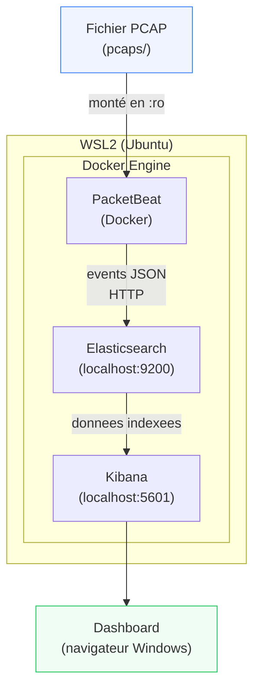

# Architecture du Projet ELK + PacketBeat

## Vue d'ensemble

Ce projet deploie une stack ELK (Elasticsearch, Kibana) sous WSL2 via Docker Compose, et utilise PacketBeat pour analyser des fichiers de capture reseau (PCAP).

## Schema d'architecture



## Composants

### WSL2

- Environnement Linux emule sous Windows via Hyper-V.
- Permet d'executer Docker nativement sans VM separee.
- Acces transparent aux ports : `localhost:9200` et `localhost:5601` sont accessibles depuis Windows.

### Docker Compose

- Orchestrateur de conteneurs utilise pour lancer Elasticsearch et Kibana.
- Reseau interne isole (`elk-net`) entre les services.
- Volume persistant `esdata` pour les donnees Elasticsearch.

### Elasticsearch

| Propriete | Valeur |
|---|---|
| Image | `docker.elastic.co/elasticsearch/elasticsearch:8.13.4` |
| Port expose | `127.0.0.1:9200` (local uniquement) |
| Stockage | Volume Docker `esdata` |
| Securite | Desactivee (projet local pedagogique) |
| Mode | Single-node |

Elasticsearch stocke et indexe tous les evenements reseau envoyes par PacketBeat sous la forme de documents JSON dans des indices `packetbeat-*`.

### Kibana

| Propriete | Valeur |
|---|---|
| Image | `docker.elastic.co/kibana/kibana:8.13.4` |
| Port expose | `127.0.0.1:5601` (local uniquement) |
| Connexion | Via reseau Docker interne vers Elasticsearch |

Interface web pour explorer, visualiser et creer des dashboards a partir des donnees indexees.

### PacketBeat

| Propriete | Valeur |
|---|---|
| Image | `docker.elastic.co/beats/packetbeat:8.13.4` |
| Execution | A la demande (via `run-packetbeat.sh`) |
| Entree | Fichier PCAP monte en lecture seule (`/pcaps`) |
| Sortie | Elasticsearch via HTTP |

PacketBeat est un agent de capture reseau de la suite Elastic Beats. En mode fichier (`-I`), il lit un PCAP existant et en extrait les evenements protocolaires (DNS, HTTP, TLS, ICMP, etc.).

### PCAP

- Format de capture reseau standard (Wireshark, tcpdump).
- Supporte : `.pcap`, `.pcapng`, `.cap`.
- Place dans `pcaps/` par l'utilisateur avant d'executer PacketBeat.

## Reseau Docker

```
elk-net (bridge)
├── elasticsearch  (elasticsearch:9200)
├── kibana         (kibana:5601)
└── packetbeat     (acces sortant vers elasticsearch)
```

Les conteneurs communiquent par nom de service (`elasticsearch`, `kibana`) sur le reseau interne Docker. Seuls les ports `9200` et `5601` sont exposes sur `127.0.0.1` (loopback uniquement).

## Securite

> **Note** : La securite Elastic (TLS + authentification) est **desactivee** dans cette configuration (`xpack.security.enabled=false`). Ce choix est delibere pour simplifier la demonstration pedagogique. Ne jamais utiliser cette configuration en production ni sur un reseau accessible.

Les bonnes pratiques appliquees malgre tout :
- Ports exposes uniquement sur `127.0.0.1` (pas `0.0.0.0`).
- PCAP montes en lecture seule (`:ro`).
- Secrets non commites (`.env` exclu par `.gitignore`).
- Fichiers PCAP exclus de Git.
