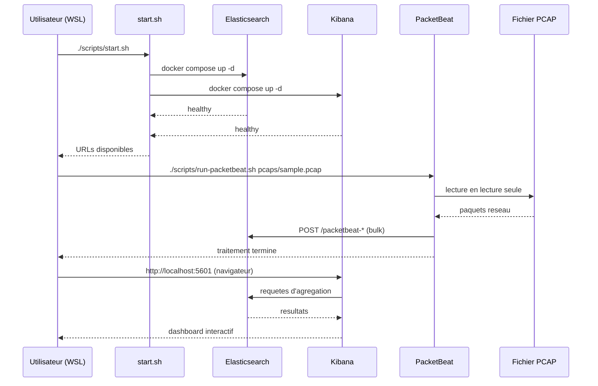

# Workflow - Analyse d'un fichier PCAP avec ELK + PacketBeat

## Vue d'ensemble du flux

```
PCAP  -->  PacketBeat  -->  Elasticsearch  -->  Kibana  -->  Dashboard
```

## Etapes detaillees

### Etape 1 : Obtenir un fichier PCAP

Plusieurs sources possibles :

- **Wireshark** : Capturer du trafic en direct et sauvegarder en `.pcap`.
- **tcpdump** (dans WSL) :
  ```bash
  sudo tcpdump -i eth0 -w pcaps/ma_capture.pcap
  ```
- **Jeux de donnees publics** : [Wireshark Sample Captures](https://wiki.wireshark.org/SampleCaptures), [CAIDA](https://www.caida.org/), [Malware Traffic Analysis](https://malware-traffic-analysis.net/).
- **CTF / securite** : Captures fournies lors d'exercices.

### Etape 2 : Placer le fichier PCAP dans `pcaps/`

```bash
cp /chemin/vers/votre_capture.pcap pcaps/
```

Le dossier `pcaps/` est monte en lecture seule dans le conteneur PacketBeat. Les fichiers PCAP ne sont pas commites dans Git (exclus par `.gitignore`).

### Etape 3 : Demarrer la stack ELK

```bash
./scripts/start.sh
```

Ce script :
1. Verifie que Docker est accessible.
2. Lance Elasticsearch et Kibana avec `docker compose up -d`.
3. Attend que les deux services soient prets.
4. Affiche les URLs d'acces.

Duree estimee : **1 a 3 minutes** selon les ressources disponibles.

### Etape 4 : Verifier la sante des services

```bash
./scripts/check-health.sh
```

Verifie que :
- Elasticsearch repond sur `http://localhost:9200`.
- Kibana repond sur `http://localhost:5601`.

### Etape 5 : Lancer PacketBeat sur le fichier PCAP

```bash
./scripts/run-packetbeat.sh pcaps/votre_capture.pcap
```

Ce script :
1. Verifie que le fichier PCAP existe.
2. Verifie qu'Elasticsearch est accessible.
3. Lance un conteneur PacketBeat ephemere (`--rm`).
4. PacketBeat lit le PCAP, extrait les evenements protocolaires et les envoie vers Elasticsearch.
5. Le conteneur se termine automatiquement a la fin du fichier.

PacketBeat cree automatiquement l'index template et les dashboards Kibana lors du premier lancement (`setup.dashboards.enabled: true`).

### Etape 6 : Explorer les donnees dans Kibana

1. Ouvrir `http://localhost:5601` dans le navigateur Windows.
2. Aller dans **Discover**.
3. Creer un **Data View** sur l'index `packetbeat-*`.
4. Selectionner une plage de temps correspondant a la capture.
5. Explorer les evenements par type de protocole, source IP, destination, etc.

### Etape 7 : Creer des visualisations

Dans Kibana > **Visualize Library** ou **Dashboard** :

Exemples de visualisations utiles :
- **Pie chart** : Repartition des protocoles (DNS, HTTP, TLS...).
- **Data Table** : Top des IPs sources ou destinations.
- **Bar chart** : Volume de trafic dans le temps.
- **Maps** : Geolocalisation des IPs (si MaxMind est configure).

### Etape 8 : Creer un dashboard

1. Aller dans Kibana > **Dashboard** > **Create dashboard**.
2. Ajouter des visualisations existantes ou en creer de nouvelles.
3. Nommer et sauvegarder le dashboard.

### Etape 9 : Exporter le dashboard

1. Aller dans Kibana > **Stack Management** > **Saved Objects**.
2. Selectionner le dashboard.
3. Cliquer sur **Export** pour obtenir un fichier `.ndjson`.
4. Sauvegarder le fichier dans `exports/` :
   ```bash
   # Renommer le fichier telechargé
   mv ~/Downloads/export.ndjson exports/dashboard-pcap-analyse.ndjson
   ```

Le dossier `exports/` est exclu de Git (sauf `.gitkeep`).

### Etape 10 : Arreter l'environnement

```bash
./scripts/stop.sh
```

Les donnees Elasticsearch sont **preservees** dans le volume Docker `esdata`. Pour tout supprimer :

```bash
docker compose down -v
```

## Diagramme de sequence


